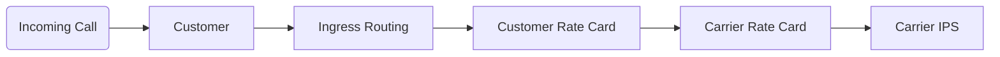

# Routing

## Route Path

**Routing** in ConnexCS Cloudswitch occurs in the following stages:

1. An incoming call is identified as a customer, and is verified by source IP or User/Pass Authentication
2. Ingress Routing checks for prefixes, then against available rate cards. There can be multiple ingress routes per customer.
3. A Customer Rate Card is built from carriers above it, so the call can be presented to any carrier who is the parent of the customer rate card.
4. The Carriers Rate Card links into the specific carrier.
5. The selected carrier can have multiple IP addresses. The call will be sent randomly, but carrier CPS and Channel limits will be obeyed.

!!! info "Routing and Rate Cards"
    A rate card in **ConnexCS** represents a call path. If the rate card is incoming, it identifies the carrier providing that rate card. The customer rate identifies which carrier rate cards are used in its construction.

## Routing Engine
The **Routing Engine** receives all calls when they enter the system then processes them based on the direction the call is flowing. 

### Ingress and Egress
These terms are used to describe the direction or traffic relative to a switch.

* **Ingress** refers to inbound calls. 
* **Egress** refers to outbound calls. 

Ex: When you add a customer's switch that will send traffic to terminate with a carrier, the customer's switch would be considered **Egress** as it is sending calls out. 
Ex: When a customer's switch has a DID pointing to it, it would be considered **Ingress** as traffic is coming into the switch. 

!!! note "Ingress Routing vs Egress Routing"
    A call bound for termination comes into the routing engine, passes authorisation, then goes through **Ingress Routing**. This determines the call profile and where to send it. There is no **Egress Routing** section, per se. The Egress routing is built into the Customer Rate Card which contains 1 or more carriers and, optionally, a routing strategy (default LCR).

### Error Codes
If your SIP Trace shows that an INVITE packet was received by the switch but not sent out to any providers, the failure has occurred in the **Ingress Routing**.

| SIP Code | SIP Reason                             | Details                                                                                                |
|:--------:|----------------------------------------|--------------------------------------------------------------------------------------------------------|
|    403   | IP Not Authorised                      | The IP Address does not match any account in the system.                                               |
|    500   | Unidentified Internal Switch           | This is an internal error; you should never see this. If you do please contact us.                     |
|    500   | Server not accepting calls (Paused)    | Your account with ConnexCS has been disabled or your server has been disabled.                         |
|    503   | Unknown User                           | Username & Passwords do not match to any known user account.                                           |
|    503   | Unable to perform LRN                  | You have selected LRN dipping for this route, however it is likely that you don't have credit with us. |
|    503   | LCR Unavailable                        | The system is unable to perform a LCR lookup.                                                          |
|    503   | Blocked by Dialplan                    | The prefix/number is not matched by the allowed dial plan.                                             |
|    503   | No Routes Available (Pre)              | There is no rate card rule to allow the call to progress.                                              |
|    503   | No Routes Available (U)                | No routes are available either due to: Lock, Profit Assurance, Routing Strategy or ScriptForge.        |
|    503   | No Routes Available (Lock)             | Locking your Ingress routing has left no routing options.                                              |
|    503   | No Routes Available (Profit Assurance) | Profit Assurance has left no routing options.                                                          |
|    503   | Dropping Call (Strategy)               | Strategic Routing has dropped the call.                                                                |
|    503   | Internal Strategic Routing Error       | There is an error with the config of Strategic Routing.                                                |
|    580   | No Route Available                     | The number dialled does not match any ingress routing profile.                                         |
|    580   | Switch IP Variable Not Provided        | This is an internal error; you should never see this. If you do please contact us.                     |
|    580   | To (oU) User Missing                   | This is an internal error; you should never see this. If you do please contact us.                     |
|    580   | To (fU) User Missing                   | This is an internal error; you should never see this. If you do please contact us.                     |

!!! info "End Point synchronisation"
    When making changes, although we try to synchronise all endpoints as fast as possible, as this is a distributed system it can take up to 60 seconds for any changes to take effect.

[call-flow]: /misc/img/call-flow.jpg "Call Flow"

