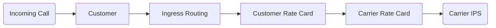
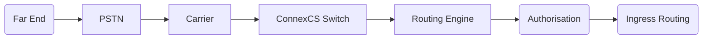
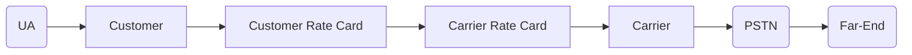

# Routing

---
**Document Metadata**  
**Category:** Routing & Call Control  
**Audience:** Administrators, Support Engineers  
**Difficulty:** Intermediate  
**Time Required:** 1-2 hours  
**Prerequisites:** [Carrier Setup](carrier.md), [Customer Setup](customer/customer.md), [Rate Cards](rate-card-building.md)  
**Related Topics:** [Routing Strategy](routing-strategy.md), [Global Routing](global-routing.md), [Customer Routing](customer/routing.md)  
**Next Steps:** [Routing Strategy](routing-strategy.md), [Circuit Test](circuit-test.md)

---

## Route Path

**Routing** in ConnexCS CloudSwitch occurs in the following stages:

1. An incoming call leads to customer identification and confirmed by the source IP or User / Pass Authentication.
2. Ingress Routing looks for prefixes and then compares them to available rate cards. There can be several ingress routes per customer.
3. You can build a Customer Rate Card from the carriers above it. Also, the parent of the customer card can present the call to any carrier who is the parent of the customer rate card.
4. The Carriers Rate Card links you with a specific carrier.
5. The selected carrier can have several IP addresses. Also, it makes a random call, but carrier Calls per Second (CPS) obeys the Channel limits.

!!! info "Routing and Rate Cards"
    A rate card in **ConnexCS** represents a call path. If the rate card is incoming, it identifies the carrier providing that rate card.

    Customer rate identifies the carrier rate cards used for its construction.

## Routing Engine

The **Routing Engine** receives all calls when they enter the system and then processes them based in which the direction in the call is flowing.

### Ingress

**Ingress** refers to inbound calls destined to terminate with one of our customers (UA, phone, Direct Inward Dialing (DID), etc.)

A call bound for termination with one of our customers comes into the routing engine, passes authorisation, and then goes through **Ingress Routing**.

This determines the call profile and where to send it.

!!! example "Ingress Example"
    When a customer's switch has a DID pointing to it, it's considered **Ingress** because traffic is coming into the switch.

### Egress

**Egress** refers to outbound calls. **Egress Routing** section isn't available. The Customer Rate Card includes the Egress routing, which contains 1 or more Carriers, and, optionally, a routing strategy (such as Default LCR).

!!! tip "Egress Example"
    When you add a customer's switch that will send traffic to terminate with a carrier, **Egress** is the customer's switch in that case, as it's sending calls out.

### Error Codes

If your Session Initiation Protocol (SIP) Trace shows that an INVITE packet was received by the switch but not sent out to any providers, the failure has occurred in the **Ingress Routing**.

| SIP Code | SIP Reason| Details|
|:--------:|----------------------------------------|--------------------------------------------------------------------------------------------------------|
|**401**| IP Not Authorised| The IP Address doesn't match any account in the system.|
|**404**|Not Found | The number does not exist.|
|**408**| Request Timeout|If the request wasn't answered or wasn't able to get a reply from the other side|
|**487**| Request Terminated|If the caller closes the phone before connection|
|**500**| Unidentified Internal Switch| This is an internal error; you should never see this. If you do please contact us.|
|**500**| Server not accepting calls (Paused)| Either your account or server gets disabled with ConnexCS.|
|**503**| Unknown User| Username & Passwords don't match to any known user account.|
|**503**| Unable to perform LRN| You have selected LRN (Location Routing Number) dipping for this route, so it's likely that you don't have credit with us.|
|**503**| LCR Unavailable| The system is unable to perform a Least Cost Routing (LCR) lookup.|
|**503**| Blocked by Dial plan| The prefix/number isn't matched by the allowed dial plan.|
|**503**| No Routes Available (Pre)| No rate card rule to allow the call to progress.|
|**503**| No Routes Available (U)| No routes are available either due to: Lock, Profit Assurance, Routing Strategy or ScriptForge.|
|**503**| No Routes Available (Lock)| Locking your Ingress routing has left no routing options.|
|**503**| No Routes Available (Profit Assurance) | Profit Assurance has left no routing options.|
|**503**| Dropping Call (Strategy)| Strategic Routing has dropped the call.|
|**503**| Internal Strategic Routing Error| An error with the config of Strategic Routing.|
|**580**| No Route Available| The number dialled doesn't match any ingress routing profile.|
|**580**| Switch IP Variable Not Provided| This is an internal error; you should never see this. If you do please contact us.|
|**580**| To (oU) User Missing| This is an internal error; you should never see this. If you do please contact us.|
|**580**| To (fU) User Missing| This is an internal error; you should never see this. If you do please contact us.|

!!! note "4XX vs 5XX"
    4xx codes are Client Failure Responses, while 5XX are Server Failure Responses. 
    For example, it doesn't mean that the server couldn't deliver the call but it means the server knows that the number doesn't exist.

!!! info "End Point synchronisation"
    When making changes, although we try to synchronise all endpoints instantly, as this is a distributed system, it can take up to 60 seconds for any changes to take effect.

[call-flow]: /misc/img/call-flow.jpg "Call Flow"
