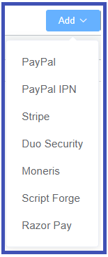
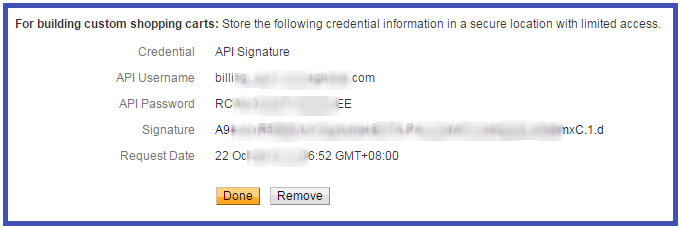

# Application Programming Interface (API) Integrations

**Setup :material-menu-right: Integrations :material-menu-right: API**

Integrate an [**API**](https://docs.connexcs.com/api/) to allow ConnexCS to access the external services.

For inbound APIs, please see the in the Architecture documentation.

## Available Integrations

+ **PayPal Express Checkout**: Allows you to online checkout via the customer portal using a [**PayPal**](https://www.paypal.com) account.

+ **PayPal IPN**: Enable Instant Payment Notification (IPN) to use MassPay or to send money from the PayPal portal without using your site. This also notifies the system of incoming PayPal payments, and we can top up based on that notification.  

+ **Stripe**: Possibly the world's best credit card processor, [**Stripe**](https://www.stripe.com) can be made available on your customer portal.

+ **Duo Security**: To approve login, [**Duo Security**](https://duo.com/) provides 2FA (2 Factor Authentication) via an out-of-band push notification to your mobile device. It also provides fingerprint authentication for extra security.

+ **Moneris**: [**Moneris**](https://www.moneris.com/) is a Canadian Credit Card Processing service.

+ **ScriptForge**: [**ScriptForge**](/developers/scriptforge/) is the ConnexCS JavaScript Sandbox environment, where you can write drivers to intermediate connectivity to a large variety of providers.

+ **Razor Pay**: [**Razor Pay**](https://razorpay.com/) is a large payment processor from India.

## Enable API Integration

**1.** Click **`Add`**.

**2.** Select the required service from the list.

**3.** Complete the available fields (see individual API integrations below for details for each provider).

**4.** Click **`Save`**.

!!! info "API Service Details"
    Each service requires different details. You can obtain these using your account with the specific provider(s).

## Compare PayPal Options

**Mass Payment** is a bulk payment method that sends funds to PayPal in the form of an uploaded file, allowing the sender to pay less than the standard PayPal fees due to bulk order discounts. Since this payment doesn't trigger anything in our VoIP system, we link into PayPal's IPN to accommodate notifications and balance sheet updates.

**Mass Pay vs. Express Checkout**

Use this comparison chart to decide between Mass Pay and Express Checkout with PayPal.

|Mass Pay|Express Checkout|
|---|---|
|A CSV (Comma-Separated Values) is uploaded to PayPal's website.|Made through the customer portal.|
|Slightly lower transaction fees.|Standard PayPal fees (about 3.4% + $0.30).|
|Fees are paid by the sender.|Fees are paid by the recipient.|
|The sender pays a 2% transaction fee, capped at $1 per payment.|The recipient is charged on a per-transaction basis.|
|Uses PayPal IPN.|Uses PayPal API Signature.|

## PayPal Express Checkout Integration

Enter the PayPal credentials into your account.

**1.** Select **`Add`** and then select **PayPal**.

**2. Mode**: Use `Test` for testing connections or `Live` for an active account.

**3.** To find your **Username**, **Password**, and **Signature**:

**3.1.** To access your PayPal account, navigate to **Settings :material-menu-right: Account Settings :material-menu-right: Account Access**.

**3.2.** For **API Access**, click **`Update`**.

**3.3.** In the **NVP/SOAP API Integration (Classic)** section, select **Manage API Credentials**.

*(NVP: Name-Value Pair; SOAP: Simple Object Access Protocol)*

**3.4.** Select **Request API Signature**, and then click **`Agree and Submit`**.

**4.** Copy the **API Username**, **API Password**, and **Signature** credentials from this page into the open PayPal form in ConnexCS.

**5. Currency**: Select one or more currencies that you will accept.

**6. Deduct Payment Fees**: Set whether you will deduct the fees or not.

**7.** Click **`Save`**.

## PayPal IPN Integration

PayPal's **Instant Payment Notification (IPN)** is a service that provides notifications for PayPal transactions. IPN messages are used to automate bulk payment processes where consumers still send PayPal payments as usual. Payments made using this integration will automatically top up the customer's account in ConnexCS. For this to work, you need to configure the settings on the ConnexCS control panel and in PayPal.

### Configure PayPal IPN

Steps to configure IPN:

**Step 1: Configure ConnexCS**

**1.1.** Select **`Add`** and then select **PayPal IPN**.

**1.2.** Update the following:

+ **IPN URL**: You should never modify this; it's required later to complete the integration.
+ **Payment Type**: Select "Mass Pay" (described above) or "Send Money" (fees may apply).
+ **Verify Transaction**: If selected, ConnexCS will check with PayPal to make sure the transaction is correct.
+ **Currency**: Select one or more currencies that you will accept.
+ **Deduct Payment Fees**: Set whether you will deduct the fees or not.

**1.3.** Click **`Save`**.

**1.4.** To find the IPN URL (needed later in configuration), open the **`paypal_ipn`** now listed in API.

**Step 2: Identify your IPN listener to PayPal**

After you have configured ConnexCS, add it to your PayPal account (taken from PayPal support [**here**](https://developer.paypal.com/docs/api-basics/notifications/ipn/IPNSetup/#)).

**2.1.** Login to a PayPal Business Account (it must be a Business account, not a regular PayPal account).

**2.2** Navigate to **Settings > Account Settings > Notifications**.

**2.3.** Select **Update** next to **Instant payment notifications**.

**2.4.** Click **Choose IPN Settings**.

**2.5.** Enter the IPN URL under **Notification URL** and select **Receive IPN Messages (Enabled)**,and then click **Save**.

**2.6.** Fill in the settings and then copy the API URL.

### Configure the Customer with PayPal Email address

The following are instructions on how to add a PayPal Email address to a ConnexCS customer account:

**1.** Navigate to **Management :material-menu-right: Customer :material-menu-right: [Customer name]**.

**2.** In Contacts, click :material-plus:.

**3.** Enter the customer's name and PayPal email address, and then click **`Save`**.

**4.** On the customer's main page, select Edit :material-menu-right: Config.

**5.** Enter the customer's PayPal email ID and click **`Save`**.

### View the PayPal IPN Payment Log

You can view these payments under **Setup :material-menu-right: Information :material-menu-right: Payment Log**.

## Stripe Integration

Configure the Stripe API Keys in ConnexCS:

**1.** Select **`Add`** and then select **Stripe**.

**2. Mode**: Use `Test` for testing connections or `Live` for an active account.

**3. Public Key** (Publishable) and **Private Key** (Secret): Access the [**Stripe Dashboard**](https://dashboard.stripe.com/account/apikeys) (login if necessary) to access your keys (from [**Stripe Support**](https://stripe.com/docs/keys); `Test` keys are available in that link).

**4. Currencies**: Select one or more currencies that you will accept.

## Duo Security Integration

Configure Duo Security settings in ConnexCS:

**1.** Select **`Add`** and then select **Stripe**.

**2. Integration Key**, **Secret**, and **Host**: Access the [**Duo Admin Panel**](https://admin.duosecurity.com/), locate **`Auth API`**, click `Protect` (from [**Duo Auth support**](https://duo.com/docs/authapi)). Find the **Integration Key**, **Secret Key**, and **API Hostname** to complete the setup in ConnexCS.

## Moneris Integration

Link Moneris to ConnexCS:

**1.** Select **`Add`**, and then select **Moneris**.

**2. Store ID**: You can find this in the MRC Welcome emails (contact [**Moneris**](https://www.moneris.com/) for assistance in finding this).

## Scriptforge Integration

**1.** Select **`Add`** and then select **Scriptforge**.

**2. Company**: Select the customer to integrate.

**3. Script Forge**: Select the predefined script (details found under [**Developer :material-menu-right: Scriptforge**](/developers/scriptforge/).

## Razor Pay Integration

Enter Razorpay settings into ConnexCS:

**1.** Select **`Add`** and then select **Razorpay**.

**2. Mode**: Use `Test` for testing connections or `Live` for an active account.

**3. Key ID** and **Key Secret**: Access [**Razorpay Dashboard**](http://dashboard.razorpay.com/), navigate to Settings, and create a test key (from [**Razorpay support**](https://knowledgebase.razorpay.com/support/solutions/articles/11000060257-how-do-i-generate-the-api-keys-)).

1. **Currency**: Select one or more currencies that you will accept.
2. **Deduct Payment Fees**: Set whether you will deduct the fees or not.

## Xero Integration

*Coming soon*

## Paystack Integration

Configure the Paystack Payment settings in ConnexCS:

**1.** Select **`Add`** and then select **Paystack**.

**2. Mode**: Use `Test` for testing connections or `Live` for an active account.

**3. Public Key** (Publishable) and **Private Key** (Secret)**: Access the [Paystack Support Link]([https://support.paystack.com/hc/en-us/articles/360009881600-Paystack-Test-Keys-Live-Keys-and-Webhooks](https://support.paystack.com/hc/en-us/articles/360009881600-Paystack-Test-Keys-Live-Keys-and-Webhooks)) to access the Test keys and Live keys.

**4. Currencies**: Select one or more currencies that you will accept.

## PayMongo Integration

Configure the PayMongo Payment settings in ConnexCS:

**1.** Select **`Add`** and then select **PayMongo**.

**2. Mode**: Use `Test` for testing connections or `Live` for an active account.

**3. Public Key** (Publishable) and **Private Key** (Secret)**: Access the [PayMongo API Reference Guide]([https://developers.paymongo.com/reference/getting-started-with-your-api](https://developers.paymongo.com/reference/getting-started-with-your-api)) to retrieve the Secret keys.

**4. Currencies**: Select PHP (Philippine Peso) as the type of currency.
