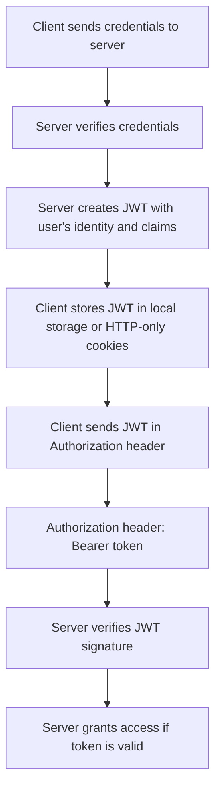

# Service-Based Authentication System

## Introduction

A Service-Based Authentication System ensures that the right identities are authenticated across all services, applications, and APIs.

This architecture allows for centralized authentication services that can be leveraged across microservices or distributed environments.

* **Centralized Authentication**: Authentication is handled centrally, allowing multiple services to use the same method for validating user identities (either via Basic Auth or JWT).
* **Flexibility**: Both Basic Auth and JWT will be supported during the transition period.
* **Scalable Authentication**: As the system grows, using JWTs will allow for stateless, secure, and efficient management of user authentication across distributed systems.

This section explains the two main authentication methods employed by our service-based authentication system:

1. **Basic Authentication (Basic Auth)**
2. **JSON Web Tokens (JWT)**

## Basic Authentication (Basic Auth)

### How Basic Authentication Works?

Basic Authentication is one of the simplest forms of HTTP authentication, used to verify a user’s identity before granting access to a protected resource or API endpoint.

**Here’s how it operates**:

1. **User Credentials (Email and Password):**
The client (such as a web browser or API client) collects the user’s email and password.
These credentials are combined into a single string using the following format:

    ```js
    email:password
    ```

2. **Encoding Credentials:**
This string is then **Base64-encoded** to obfuscate it during transmission (though it’s not true encryption).
The encoded value is included in the HTTP request header under the Authorization field, like so:

    ```js
    Authorization: Basic base64encoded(email:password)
    ```

3. **Server Validation**:

When the server receives the request, it:

Decodes the Base64 string back to the original email and password.

Verifies these credentials against the stored user records (usually within a secure user database).

If the credentials match, the server grants access to the requested resource.

If not, it returns an HTTP 401 Unauthorized response.

.4. **Session Scope:**
Since Basic Auth sends the credentials with every request, it does not maintain session state. Each request must include the Authorization header.

###@ Important Notes

1. Basic Authentication should always be used over HTTPS (TLS/SSL) to prevent exposure of credentials in transit.

2. Email and password are stored securely on the server side (hashed and salted, not in plain text).

3. For improved security and scalability, token-based authentication (e.g., JWT) is often preferred for modern systems.

### Why Use Basic Auth?

**Basic Auth** is simple to implement and widely supported, making it a practical solution for internal services or low-traffic environments where security is less of a concern.

### Limitations of Basic Auth

* **Repetitive Credential Transmission**: Credentials are sent with each HTTP request, increasing the chances of interception or leakage.
* **Storage in Logs**: Because the credentials are sent with every request, they may get logged by proxy servers, which could create security vulnerabilities.

---

## JSON Web Tokens (JWT)

### How JWT Works?

**JSON Web Tokens (JWTs)** are a more advanced authentication method that is gaining popularity due to their **self-contained** nature.

Here's how JWTs work:

1. **Token Structure**: A JWT consists of three parts:

   * **Header**: Specifies the signing algorithm and type of token (e.g., JWT).
   * **Payload**: Contains the claims (data) such as user ID, roles, and expiration time. It is **Base64 encoded**, but **not encrypted**. This means anyone with the token can decode and view the data.
   * **Signature**: A cryptographic signature that ensures the integrity of the token. The server generates this signature using the payload and a secret key.

   A typical JWT looks like:

   ```
   Header.Payload.Signature
   ```

2. **Authorization Flow**:

   * The client sends their credentials to the server.
   * The server verifies the credentials and creates a JWT that contains the user’s identity and other claims.
   * The client receives the JWT and stores it (usually in local storage or HTTP-only cookies).
   * With each subsequent request, the client sends the JWT in the `Authorization` header as a **Bearer token**:

     ```
     Authorization: Bearer token
     ```
   * The server verifies the signature and grants access if the token is valid.



### Advantages of JWT

* **Stateless**: The server does not need to maintain a session. Each JWT contains all the data required for authentication, which improves performance and scalability.
* **No Password Resend**: Unlike Basic Auth, JWT does not require sending the user’s password with every request. The user’s identity is verified with the JWT itself.
* **Fast**: JWT verification is faster compared to querying a database on each request, as it does not require server-side session lookups.
* **Built for Scalability**: JWTs allow for a distributed architecture where different services can independently verify the tokens without needing to share session state.

### Limitations of JWT

* **Exposure of Claims**: While the signature prevents modification, anyone with access to the JWT can decode the payload and see its claims. Sensitive information like passwords or personal data should never be included in the payload.
* **Token Revocation**: JWTs are stateless, meaning that once issued, they cannot be revoked until they expire. This presents a challenge in managing security, especially if a token is compromised before its expiration.

---
