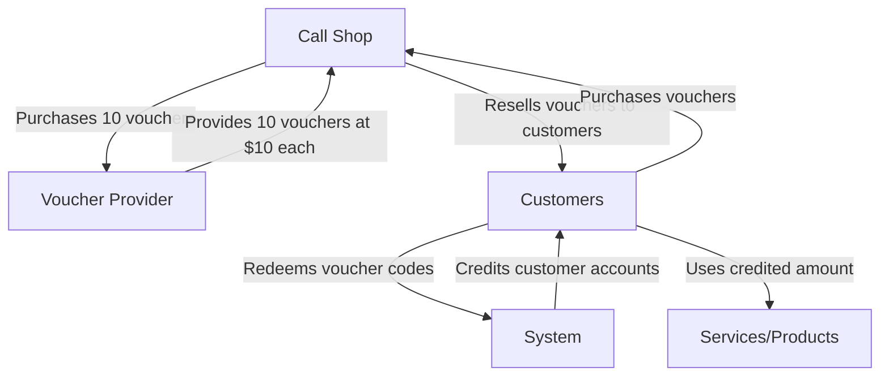
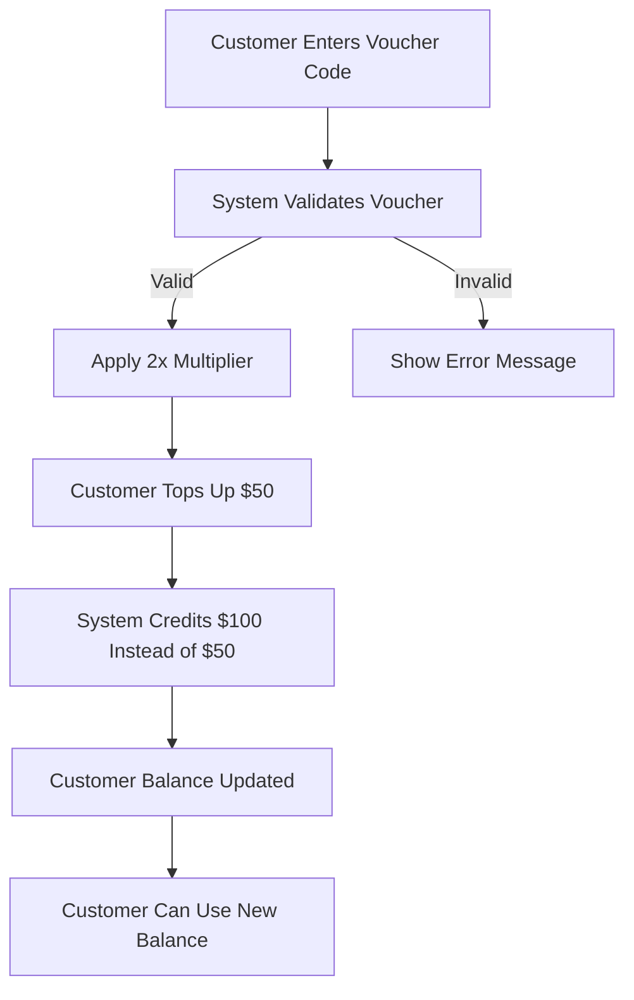
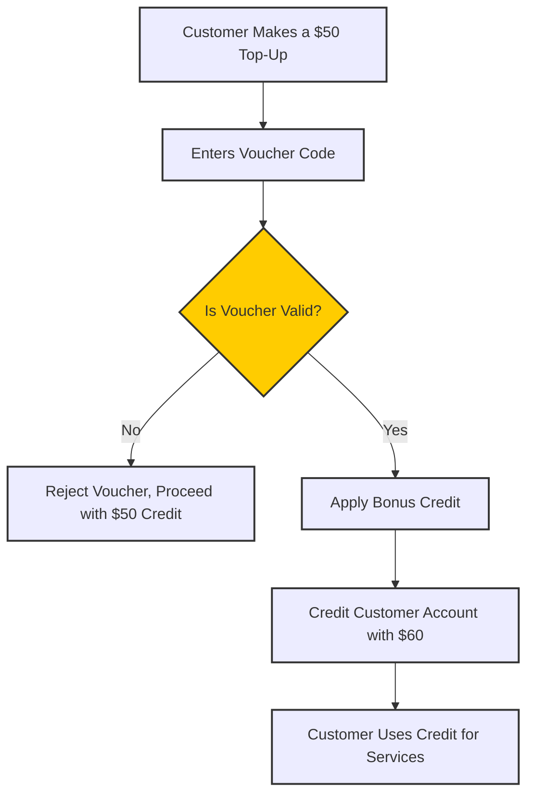

# Vouchers

**Management :material-menu-right: Vouchers**

## Overview

**Vouchers**, also known as **calling cards**, provide an alternative method for crediting an account.

This feature enables pre-generated codes with monetary value to be used for account top-ups.

**Vouchers** are available in both the Customer Portal and on WebPhone.

!!! question "Where to use Vouchers?"
    1. **Call shops**: Businesses can purchase vouchers in bulk and resell them to customers.
    2. **Promotional Offers**: Businesses can create special promotions with additional credit incentives.
    3. **Third-party Sales**: Independent sellers can distribute vouchers to users, allowing them to top up their accounts.

### How Vouchers Work?

**Step 1: Voucher Generation**: Admins can generate multiple vouchers with pre-set values.

**Step 2: Distribution**: Vouchers can be sold to third-party businesses or customers directly.

**Step 3: Redemption**: Customers enter the voucher code in the system to credit their account.

**Step 4: Tracking & Management**: Admins can monitor, bulk edit, and disable expired or unused vouchers.

### Key Features and Benefits

1. **Bulk Voucher Management**: 

   + **Bulk Generation**: Generate multiple voucher codes at once.

   + **Bulk Editing**: Modify or disable multiple vouchers simultaneously.

   + **Status Updates**: Track which vouchers are used, expired, or available.

2. **Flexible Account Credit System**: Enables multiple ways for customers to add funds.

3. **Third-Party Sales Opportunities**: Allows independent sellers to distribute prepaid calling credit.

4. **Promotional and Incentive Capabilities**: Supports marketing campaigns with bonus credit options.

5. **Efficient Management Tools**: Bulk creation and editing simplify voucher handling.

## Voucher Types

You can issue Vouchers in one of the following 3 forms:

* **Free Credit:** Once you enter the voucher code the credit applies independently of any other payment.
* **Multiplier Credit:** For example, Credit doubled for a top-up of $50 or more.
* **Additional Credit:** For example, $50 free credit for top-up of $100 or more.

## Voucher Setup

Click **`Add`**

* **Count:** Enter the number of vouchers you wish to create.

!!! Warning "You can use a voucher only once"

* **Status:** Used for tracking the voucher as **Available** (avaible to use), **Used** (already exhausted), or **Disabled** (can't be used).

* **Minimum Activation:** Set a required spend before the voucher activates.

!!! Example
    Spend 50 dollars before getting an extra $10.

**Set to '0' to give a customer entirely free credit.**

* **Multiplier:** Enter the multiplier that applies to the customer's paid balance. It increases the top-up amount when a voucher is redeemed.

!!! Example
    For a 10% bonus, set the Multiplier to 1.1.

* **Addition:** Enter the extra credit that applies to the customer's account. Adds a fixed extra amount upon redemption.

!!! Example
    Set 50 to give them $50, with or without a spend of their own, based on the Minimum Activation.

* **Currency Selector:** Select the desired currency.

Select **`Save`**, and the system will generate the vouchers.

!!! Info "Unique Code (ID)"
    Each voucher has a unique identifier, after voucher creation.

## Use Case Scenarios

1.**Standard Voucher Purchase**

2.**Promotional Multiplication**

3.**Bonus Credit Offers**

[voucher-grid]: /misc/img/voucher-grid.png "Voucher Grid"
[voucher-add]: /misc/img/voucher-add.png "Add Voucher"
