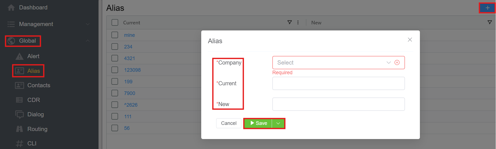

# Alias

**Global :material-menu-right: Alias**

## Overview

The Alias feature allows for complete or partial number rewriting before further processing.

Alias will re-write the destination number.

## Create Alias

1. Navigate to **Global :material-menu-right: Alias**
2. Click :material-plus:.
    + **Company**: Select the country from the drop-down.
    + **Current**: Current number or script (regex).
    + **New**: Set to another number or script (regex).
3. Click **`Save`**.

## Processing Order

Number modifications occur in a structured sequence:

1. **Parameter Rewrite**: Initial modifications to parameters.
2. **Alias Processing**: Number rewriting based on alias rules.
3. **Routing**: The final step that determines the call's destination based on the modified number.

Each stage contributes to refining the call flow for optimal routing and handling.
